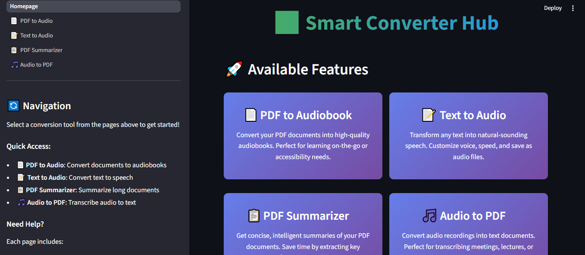
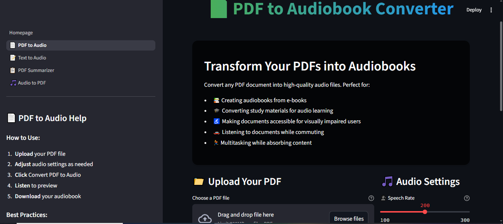
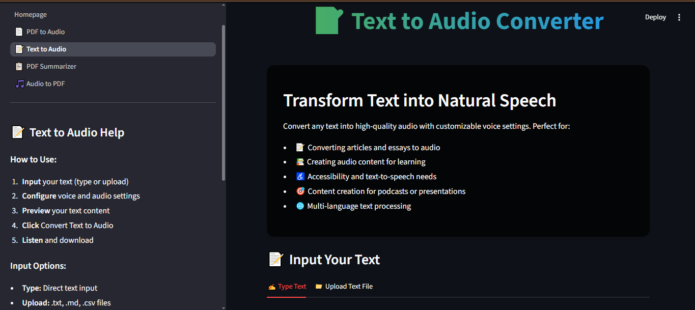
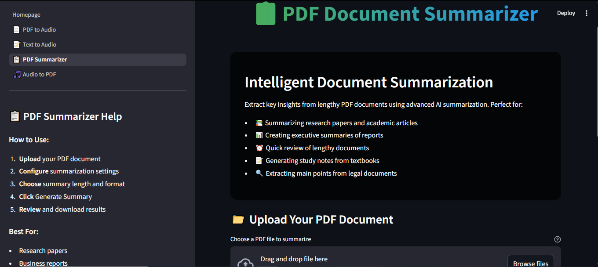
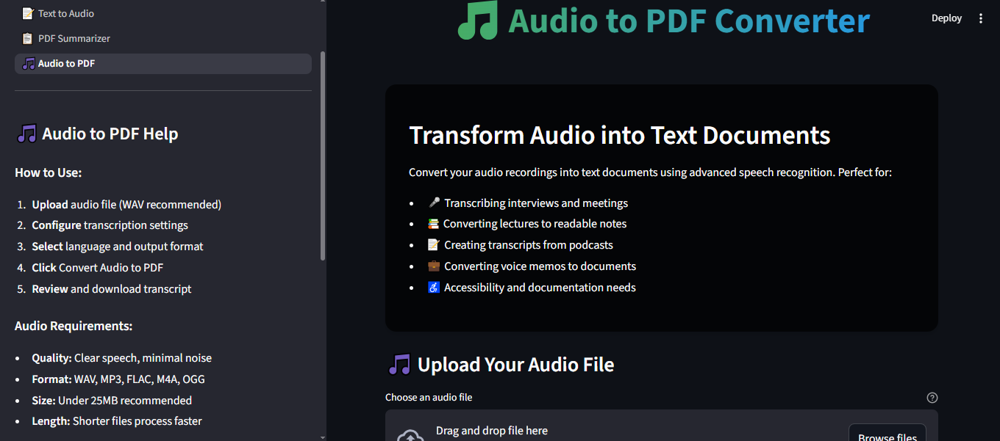

# 🔄 Smart Converter Hub

A comprehensive and elegant **Streamlit-based web application** for intelligent file conversion. Transform PDFs, text, and audio into insightful and accessible formats using AI-powered tools.

---
## 🚀 Live Demos

### 🌐 Streamlit Cloud  
[](https://fulatx9v7y4wfoq4apwkr8.streamlit.app/)

👉 [https://fulatx9v7y4wfoq4apwkr8.streamlit.app/](https://fulatx9v7y4wfoq4apwkr8.streamlit.app/)

---

### ☁️ Render Deployment  
[](https://smart-converter-hub.onrender.com/)

👉 [https://smart-converter-hub.onrender.com/](https://smart-converter-hub.onrender.com/)


## 🌟 Features

### 📄 PDF to Audiobook Converter
- Convert PDF documents into high-quality audio files
- Adjustable speech rate, volume, and gender
- Ideal for visually impaired users and on-the-go listening

### 📝 Text to Audio Converter  
- Transform any input text or uploaded file into natural speech
- Supports both **MP3** and **WAV** formats
- Customize voice speed, gender, and volume

### 📋 PDF Summarizer
- Generate intelligent summaries from lengthy PDF documents
- Uses NLP (TF-IDF, tokenization, scoring) for key point extraction
- Choose summary length and export as text

### 🎵 Audio to PDF Converter
- Transcribe audio recordings into structured documents
- Export to **PDF**, **TXT**, **Markdown**, or **RTF**
- Supports multiple languages and optional timestamps


## 🚀 Quick Start

### 🔧 Prerequisites
- pip (Python package manager)
- Internet connection (for transcription/speech recognition)


### NLTK SEtup
   ```python
   import nltk
   nltk.download('punkt')
   nltk.download('stopwords')
   ```

## Run the application
   ```bash
   streamlit run Homepage.py
   ```


## 📁 Project Structure

```
Smart_Converter_Hub/
│
├── assets/                      # Static assets (e.g., background images)
│   └── tech_bg.png
│
├── pages/                       # Streamlit multipage structure
│   ├── 01_📄_PDF_to_Audio.py        # Converts PDF text to audiobook
│   ├── 02_📝_Text_to_Audio.py       # Converts typed or uploaded text to speech
│   ├── 03_📋_PDF_Summarizer.py      # AI-based summarization of PDF documents
│   └── 04_🎵_Audio_to_PDF.py        # Transcribes audio into text and converts to PDF
│
├── temp/                        # Temporary storage for files
│   └── (auto-deleted files)
│
├── utils/                       # Reusable helper functions
│   ├── converters.py               # Core logic for PDF, text, audio conversion and summarization
│   └── styling.py                 # CSS styling and layout utilities for Streamlit
│
├── Homepage.py                  # Main homepage entry point for the Streamlit app
│
├── requirements.txt             # Python package dependencies

```

## 🔧 Dependencies

### Core Libraries
- **streamlit**: Web application framework
- **PyPDF2**: PDF text extraction
- **gtts**: Google Text-to-Speech conversion
- **SpeechRecognition**: Audio-to-text conversion
- **nltk**: Natural language processing
- **pdfplumber**: Advanced PDF processing
- **fpdf** – Exporting transcript to PDF

### Additional Requirements
- **PyAudio**: Audio input/output (may require system-level installation)
- **torch**: Deep learning backend (for advanced features)
- **transformers**: State-of-the-art NLP models

## 💡 Usage Tips

### For PDF to Audio:
- Use text-based PDFs (not scanned images)
- Adjust speech rate for comfortable listening
- Test with shorter documents first

### For Text to Audio:
- Use proper punctuation for better pronunciation
- Break long texts into smaller chunks
- Choose appropriate voice settings

### For PDF Summarizer:
- Works best with structured documents
- Optimal for documents with 500+ words
- Currently optimized for English content

### For Audio to PDF:
- Use WAV format for best results
- Record in quiet environments
- Speak clearly and at moderate pace

## 🎨 Customization

### Changing Background Image
1. Replace `assets/tech_bg.png` with your preferred image
2. Ensure the image is in PNG format
3. Restart the application

### Modifying Styles
- Edit `utils/styling.py` to customize colors and layouts
- Modify CSS classes for different visual themes


**NLTK Data Missing:**
```python
import nltk
nltk.download('all')  # Downloads all NLTK data
```

**Audio Conversion Issues:**
- Ensure system audio drivers are working
- Upload WAV files for better compatibility
- Try different TTS engines if available
- Check microphone permissions for audio input

**Large File Processing:**
- Break large files into smaller chunks
- Increase system memory if possible
- Use cloud deployment for better resources

## 🚀 Deployment

### Local Development
```bash
streamlit run Homepage.py
```

## 📸 DEMO Screenshots

### 🔄 Homepage


### 📄 PDF to Audio


### 📝 Text to Audio


### 📋 PDF Summarizer


### 🎵 Audio to PDF



## 🙏 Acknowledgments

- Streamlit team for the amazing framework
- NLTK developers for NLP tools
- OpenAI for inspiration in AI applications
- Python Open Source Community

---

**Smart Converter Hub** - Transform • Convert • Innovate 🔄
---
## Built by Akrit Pathania